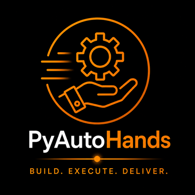

<p align="center">
  
</p>

# PyAutoHands

[](https://github.com/PyAutoLabs/PyAutoScientist) [](https://pyautoscientist.readthedocs.io)

[](https://pyautolabs.github.io/PyAutoHands/)

**PyAutoHands is the Hands of the PyAutoScientist** — the executor that ships
the software. When a release is dispatched it packages, tags, regenerates
notebooks, and publishes the PyAuto libraries and their workspaces to PyPI.
It executes on behalf of the Brain and never decides for itself: no readiness
checks, no gate decisions — those belong to the Heart.

See the **[PyAutoHands Dashboard](https://pyautolabs.github.io/PyAutoHands/)**
for what shipped: the released library versions and
their PyPI status, the release train's recent runs, and the nightly cadence —
each actionable item carrying a one-tap 📋 button that copies a ready-made
Claude command (`/release`, `/release rehearse`, `/release validate`,
`/build`; a failed train run copies a `/bug …` prompt with its run link).

## Latest release

<!-- The line below is auto-updated by .github/workflows/release_board.yml (everything -->
<!-- between the hands:begin/hands:end markers is replaced with the rendered strip). -->
<!-- hands:begin -->
📦 **2026.8.23.1** · shipped 2026-08-23 (6d ago) · last train run ✓ [2026-08-29](https://github.com/PyAutoLabs/PyAutoHands/actions/runs/33229144397) · [dashboard →](https://pyautolabs.github.io/PyAutoHands/)
<!-- hands:end -->

## How PyAutoHands works

1. **The Brain decides, the Hands execute.** A release is dispatched by the
   Brain's release conductor (`/release`, or the nightly driver when there is
   new activity) — and only when the Heart's readiness verdict is GREEN.
2. **Rehearse first.** `release.yml` builds the five libraries, publishes to
   TestPyPI, installs the wheels, and runs the test + workspace validation
   suites against them — a full dress rehearsal before anything is public.
3. **Then ship.** On success the same workflow stamps the build tree, cuts
   the `YYYY.M.D.minor` git tag on every library, and releases to PyPI.
4. **The workspaces follow.** Notebooks are regenerated from the workspace
   scripts, Colab URLs bumped to the new tag, and every workspace repo is
   tagged to match.
5. **The record is published.** Release notes land on the libraries' GitHub
   Releases, Slack is told, and the [release board](https://pyautolabs.github.io/PyAutoHands/)
   refreshes — a past-tense record of execution, never a verdict.

## CLI examples

Every operation is reachable through one dispatcher, run from this checkout
(no pip install):

```bash
bash bin/autohands help                # list every subcommand
bash bin/autohands pre_build [minor]   # format, generate notebooks, push, dispatch release.yml
bash bin/autohands run_all             # run the workspace validation scripts
bash bin/autohands board --md          # the release board (also --html, --badge, --json)
```

Boundary and agent guidance: [AGENTS.md](AGENTS.md); the pipeline internals:
[docs/internals.md](docs/internals.md). The organism this repo is the Hands
of is described once in
[PyAutoBrain/ORGANISM.md](https://github.com/PyAutoLabs/PyAutoBrain/blob/main/ORGANISM.md)
and documented in full at <https://pyautoscientist.readthedocs.io>.
